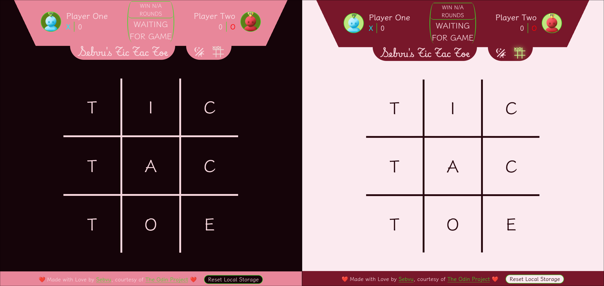

# Jester's Tic Tac Toe

Courtesy of [The Odin Project](https://www.theodinproject.com/dashboard), this is my Tic Tac Toe project! 

> [!NOTE]
> This project is *not* a reflection of what one's ability at this stage of The Odin Project should be like. If you are viewing this as a student of learning, see this as simply the potential of what could be achieved with enough creativity and time! I took too much time on this personally, do not attempt what I did.

A few fun features implemented into this.

- Theme switcher, customary of any project I do
- Locally saved profile data and theme
- Neat animations
- Customizable letters aside from X and O as well as color

**Do not spend as much time as I did on this project. Do the requirements and nothing more TOP requests from you.**

Try out the github pages! Thanks for checking my project out.
